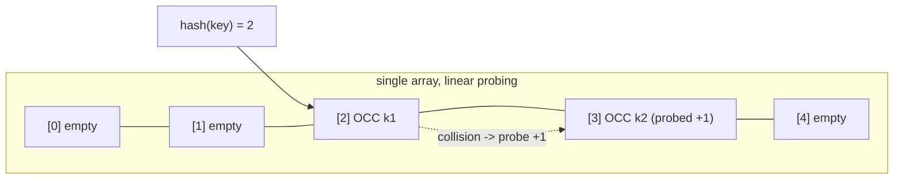
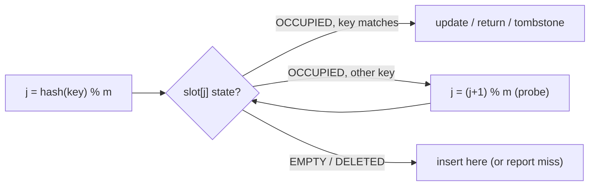

# Hash Table Open Addressing

## Concept

In an open-addressing hash table all entries live directly in a single array; there are no per-bucket lists. When a key's home slot (its hash index) is already taken, the table probes a deterministic sequence of other slots until it finds an empty one to insert into, or finds the key when searching. The simplest scheme is linear probing: step to the next slot (index + 1, wrapping around). Each slot is tagged EMPTY, OCCUPIED, or DELETED; the DELETED tombstone is essential so that lookups can probe past a removed entry without stopping early. Open addressing is cache-friendly and compact but must keep its load factor low (resize before it fills) or probe sequences grow long, degrading toward O(n).

## Mermaid



## Complexity

| Operation | Average | Worst | Notes                                       |
|-----------|---------|-------|---------------------------------------------|
| Search    | O(1)    | O(n)  | depends on load factor and clustering        |
| Insert    | O(1)    | O(n)  | probe until empty/deleted slot              |
| Delete    | O(1)    | O(n)  | mark tombstone (DELETED), not EMPTY         |

- Space: O(m) where m is the table capacity; keep load factor (n/m) well below 1.

## Java Code

```java
import java.util.Optional;

// Open-addressing hash table with linear probing and tombstones.
public class HashTable {
    private enum State { EMPTY, OCCUPIED, DELETED }

    private static final class Slot {
        String key;
        int value;
        State state = State.EMPTY;
    }

    private final Slot[] slots;
    private int count;

    public HashTable() { this(8); }

    public HashTable(int cap) {
        slots = new Slot[cap];
        for (int i = 0; i < cap; i++) slots[i] = new Slot();
        count = 0;
    }

    private int home(String key) {
        return (key.hashCode() & 0x7fffffff) % slots.length;
    }

    // Insert or update. Probes linearly past OCCUPIED slots.
    public void put(String key, int value) {
        int i = home(key);
        for (int step = 0; step < slots.length; step++) {
            int j = (i + step) % slots.length;               // linear probe
            if (slots[j].state == State.OCCUPIED) {
                if (slots[j].key.equals(key)) { slots[j].value = value; return; }  // update
            } else {                                         // EMPTY or DELETED -> reuse
                slots[j].key = key;
                slots[j].value = value;
                slots[j].state = State.OCCUPIED;
                count++;
                return;
            }
        }
        // Table full: a real implementation would rehash into a larger array here.
    }

    // Lookup: probe until we find the key or hit a truly EMPTY slot.
    public Optional<Integer> get(String key) {
        int i = home(key);
        for (int step = 0; step < slots.length; step++) {
            int j = (i + step) % slots.length;
            if (slots[j].state == State.EMPTY) return Optional.empty();  // stop: never inserted past here
            if (slots[j].state == State.OCCUPIED && slots[j].key.equals(key)) {
                return Optional.of(slots[j].value);
            }
            // DELETED -> keep probing (tombstone)
        }
        return Optional.empty();
    }

    // Delete: mark a tombstone so later probes don't terminate early.
    public boolean erase(String key) {
        int i = home(key);
        for (int step = 0; step < slots.length; step++) {
            int j = (i + step) % slots.length;
            if (slots[j].state == State.EMPTY) return false;
            if (slots[j].state == State.OCCUPIED && slots[j].key.equals(key)) {
                slots[j].state = State.DELETED; count--; return true;
            }
        }
        return false;
    }

    public int size() { return count; }

    public static void main(String[] args) {
        HashTable t = new HashTable(8);
        t.put("cat", 1);
        t.put("dog", 4);
        t.put("cat", 7);          // updates in place

        t.get("cat").ifPresent(v -> System.out.println("cat=" + v));   // cat=7
        t.erase("dog");
        System.out.println("found dog? " + (t.get("dog").isPresent() ? "yes" : "no"));  // no
        System.out.println("size=" + t.size());                        // 1
    }
}
```

## Mini Usage Example

```java
HashTable t = new HashTable(16);
t.put("x", 42);
Optional<Integer> v = t.get("x");   // v.isPresent() == true, v.get() == 42
t.erase("x");                       // leaves a DELETED tombstone
```

## Code Snippet Flow


