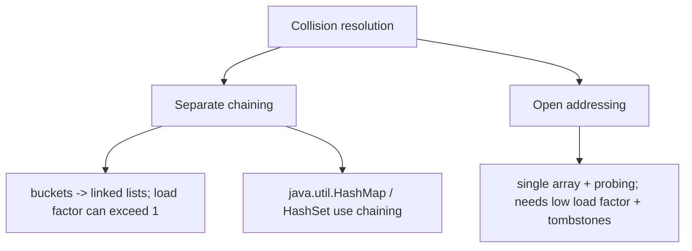
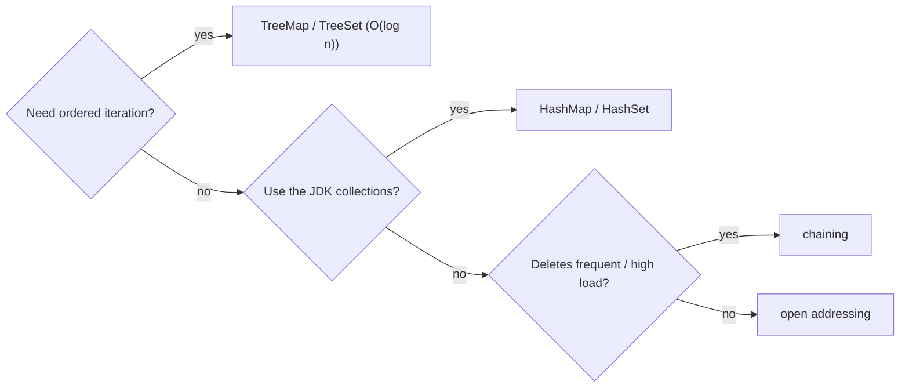

# Hashing Complexity Table

## Concept

This reference compares the hashing structures from this chapter: separate chaining, open addressing (linear probing), and the standard `java.util.HashMap`/`java.util.HashSet`. All three give average O(1) search, insert, and delete by mapping keys to slots with a hash function, and all degrade to O(n) in the worst case when collisions pile up. The key differences are how they resolve collisions and how they behave under load. Chaining stores collisions in per-bucket lists and tolerates load factors above 1; open addressing keeps everything in one array (cache-friendly, compact) but must resize well before it fills and needs tombstones for deletion. Use this table to reason about the speed/memory trade-offs.

## Mermaid



## Complexity

| Structure / scheme        | Search (avg) | Insert (avg) | Delete (avg) | Worst case | Notes                                      |
|---------------------------|--------------|--------------|--------------|------------|--------------------------------------------|
| Separate chaining         | O(1)         | O(1)         | O(1)         | O(n)       | per-bucket lists; high load factor OK      |
| Open addressing (linear)  | O(1)         | O(1)         | O(1)         | O(n)       | one array; tombstones; resize before full  |
| HashMap / HashSet         | O(1)         | O(1)         | O(1)         | O(n)*      | chaining internally; auto-rehash; Java 21  |
| (compare) TreeMap / TreeSet | O(log n)   | O(log n)     | O(log n)     | O(log n)   | red-black tree; ordered iteration          |

- Space: hashing structures O(n) plus bucket/slot overhead; load factor governs performance.
- *Java's `HashMap` treeifies long collision chains into red-black trees, so its real worst case is O(log n) per operation when keys are `Comparable`.

## Java Code

```java
// Choosing a hashing approach:
import java.util.HashMap;
import java.util.LinkedHashMap;
import java.util.Map;
import java.util.TreeMap;

void chooseHashing() {
    Map<Integer, Integer> fast   = new HashMap<>();       // average O(1), unordered -> default choice
    Map<Integer, Integer> sorted = new TreeMap<>();       // O(log n) but ordered iteration / range queries
    Map<Integer, Integer> ordered = new LinkedHashMap<>(); // O(1) but preserves insertion order
    // Custom chaining  -> tolerate high load factor, simple deletion.
    // Custom open addr -> maximize cache locality, keep load factor low (<0.7).
}
```

## Mini Usage Example

```java
// "Need average O(1) lookups, order irrelevant?" -> java.util.HashMap.
// "Need keys visited in sorted order / range scans?" -> java.util.TreeMap (O(log n)).
// "Need keys visited in insertion order?" -> java.util.LinkedHashMap.
// "Building one from scratch, deletes common?" -> chaining (no tombstones).
```

## Code Snippet Flow


