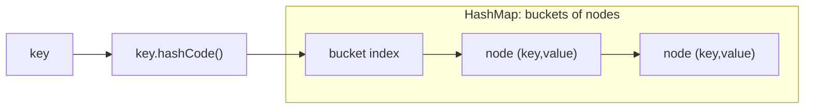
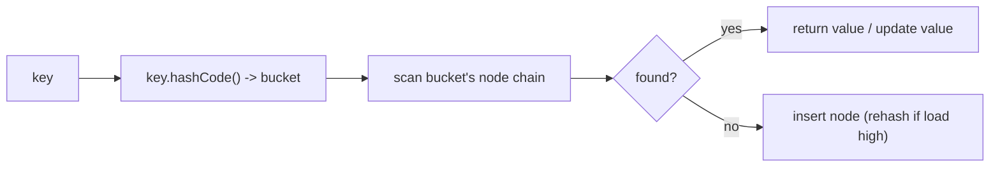

# HashMap / HashSet

## Concept

`java.util.HashMap` and `java.util.HashSet` are the Java collections framework's hash-based associative containers. `HashSet<K>` stores unique keys; `HashMap<K,V>` stores unique keys each mapped to a value. Both use separate chaining internally (an array of buckets holding nodes), so search, insert, and remove are average O(1) and worst-case O(n) — though Java treeifies long collision chains into red-black trees, bounding that worst case at O(log n) for `Comparable` keys. Elements are stored in no particular order, which is the trade-off for hashing speed compared to the tree-based `TreeMap`/`TreeSet` (ordered, O(log n)). If you need insertion-order iteration, use `LinkedHashMap`/`LinkedHashSet` (still average O(1)). They rehash automatically as the load factor grows. Reach for these whenever you need fast membership tests or key-to-value lookups and do not need sorted iteration.

## Mermaid



## Complexity

| Operation        | Average | Worst   | Notes                                  |
|------------------|---------|---------|----------------------------------------|
| get / containsKey| O(1)    | O(log n)| hash to bucket, scan chain (treeified) |
| put              | O(1)    | O(log n)| amortized; may trigger a rehash         |
| remove           | O(1)    | O(log n)| by key                                 |
| iteration        | O(n)    | O(n)    | unspecified order                      |

- Space: O(n) plus bucket array overhead.

## Java Code

```java
import java.util.HashMap;
import java.util.HashSet;
import java.util.Map;
import java.util.Set;

public class Demo {
    public static void main(String[] args) {
        // HashMap: key -> value, average O(1) operations.
        Map<String, Integer> ages = new HashMap<>();
        ages.put("alice", 30);              // insert
        ages.put("bob", 25);                // insert
        ages.put("alice", 31);              // update existing key

        if (ages.containsKey("bob"))        // O(1) average lookup
            System.out.println("bob=" + ages.get("bob"));   // bob=25

        ages.remove("bob");                 // remove by key
        System.out.println("has alice=" + ages.containsKey("alice")); // true

        // HashSet: unique membership, average O(1) contains-check.
        Set<Integer> seen = new HashSet<>();
        seen.add(10);
        seen.add(10);                       // duplicate ignored
        seen.add(20);
        System.out.println("size=" + seen.size());                    // 2
        System.out.println("has 10? " + (seen.contains(10) ? "yes" : "no")); // yes
    }
}
```

## Mini Usage Example

```java
Map<String, Integer> freq = new HashMap<>();
for (String w : new String[]{"a", "b", "a"})
    freq.merge(w, 1, Integer::sum);   // freq.get("a") == 2, freq.get("b") == 1

Set<Integer> ids = new HashSet<>(java.util.List.of(1, 2, 3));
boolean present = ids.contains(2);    // true
```

## Code Snippet Flow


