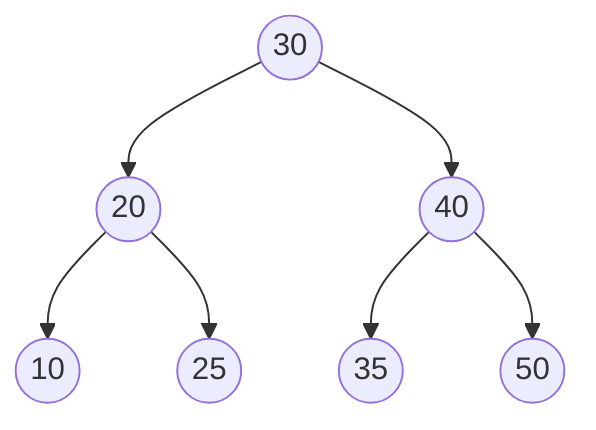

# AVL Tree

## Concept

An AVL tree is a self-balancing binary search tree named after its inventors Adelson-Velsky and Landis. It keeps the BST ordering invariant but adds a balance invariant: for every node, the heights of its left and right subtrees differ by at most one. After each insertion or deletion the tree checks the balance factor along the path back to the root and restores balance with rotations (single or double). Because the height is guaranteed to stay O(log n), all dictionary operations are worst-case logarithmic, which makes AVL trees a good choice when you need predictable performance and frequent lookups.

## Mermaid



## Complexity

- Search / Insert / Delete: O(log n) worst case, because height is bounded by ~1.44 log n
- Rotations per insertion: O(1) (at most two); per deletion: O(log n) rotations along the path
- Space: O(n) for storage, O(log n) recursion depth

## Java Code

```java
public class AVLTree {
    static class Node {
        int key, height;
        Node left;
        Node right;
        Node(int k) { this.key = k; this.height = 1; }
    }

    static int h(Node n)             { return n != null ? n.height : 0; }
    static int balanceFactor(Node n) { return n != null ? h(n.left) - h(n.right) : 0; }
    static void update(Node n)       { n.height = 1 + Math.max(h(n.left), h(n.right)); }

    // Right rotation around y (left-heavy case).
    static Node rotateRight(Node y) {
        Node x = y.left;
        Node t = x.right;
        x.right = y;
        y.left  = t;
        update(y);
        update(x);
        return x; // new subtree root
    }

    // Left rotation around x (right-heavy case).
    static Node rotateLeft(Node x) {
        Node y = x.right;
        Node t = y.left;
        y.left  = x;
        x.right = t;
        update(x);
        update(y);
        return y; // new subtree root
    }

    static Node insert(Node root, int key) {
        if (root == null) return new Node(key);
        if (key < root.key)      root.left  = insert(root.left, key);
        else if (key > root.key) root.right = insert(root.right, key);
        else return root; // duplicates ignored

        update(root);
        int bf = balanceFactor(root);

        // Left Left
        if (bf > 1 && key < root.left.key)  return rotateRight(root);
        // Right Right
        if (bf < -1 && key > root.right.key) return rotateLeft(root);
        // Left Right
        if (bf > 1 && key > root.left.key) {
            root.left = rotateLeft(root.left);
            return rotateRight(root);
        }
        // Right Left
        if (bf < -1 && key < root.right.key) {
            root.right = rotateRight(root.right);
            return rotateLeft(root);
        }
        return root;
    }
}
```

## Mini Usage Example

```java
AVLTree.Node root = null;
// Inserting sorted keys would skew a plain BST; AVL rebalances automatically.
int[] keys = {10, 20, 30, 40, 50, 25};
for (int k : keys) root = AVLTree.insert(root, k);

// After inserts the tree stays balanced; root is 30 (not 10).
// root.key == 30
```

## Code Snippet Flow

```mermaid
flowchart TD
    A[BST insert recursively] --> B[Update node height]
    B --> C[Compute balance factor]
    C --> D{|bf| > 1?}
    D -- no --> E[Return node unchanged]
    D -- yes --> F{Which case?}
    F -- LL --> G[rotateRight]
    F -- RR --> H[rotateLeft]
    F -- LR --> I[rotateLeft child then rotateRight]
    F -- RL --> J[rotateRight child then rotateLeft]
```
