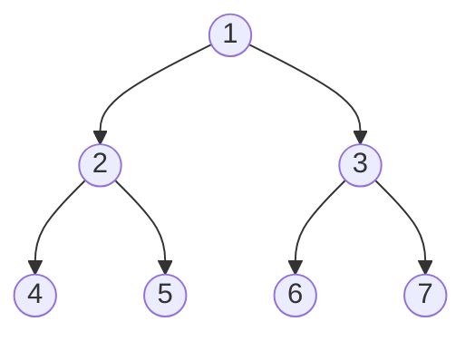
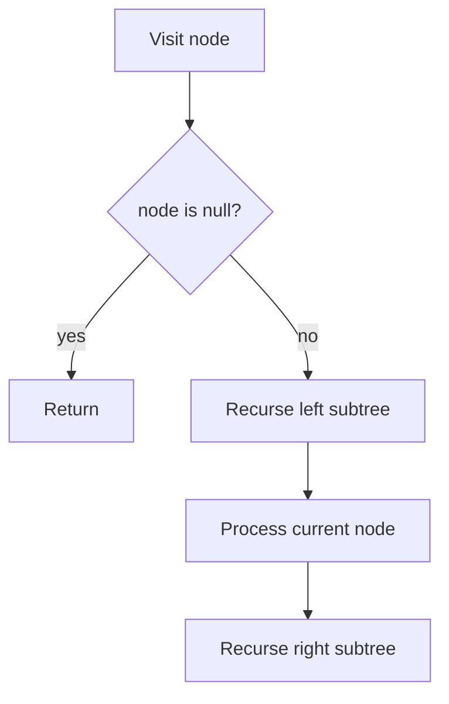

# Binary Tree

## Concept

A binary tree is a hierarchical structure where each node holds a value and has at most two children, conventionally called `left` and `right`. Unlike a binary *search* tree, a plain binary tree imposes no ordering on the values; the only invariant is the at-most-two-children shape. It is the foundation for many specialized trees (BST, heap, expression trees) and is most naturally traversed recursively. The four classic traversals are inorder (left, node, right), preorder (node, left, right), postorder (left, right, node), and level-order (breadth-first by depth).

## Mermaid



## Complexity

- Traversal (inorder / preorder / postorder / level-order): O(n) time, visiting every node once
- Recursive traversal space: O(h) for the call stack, where h is the height (O(n) worst case for a skewed tree, O(log n) when balanced)
- Level-order space: O(w) for the queue, where w is the maximum width of the tree

## Java Code

```java
import java.util.ArrayDeque;
import java.util.Queue;

// A node references its two child subtrees.
public class BinaryTree {
    static class Node {
        int val;
        Node left;
        Node right;
        Node(int v) { this.val = v; }
    }

    // Left, Node, Right
    static void inorder(Node root) {
        if (root == null) return;
        inorder(root.left);
        System.out.print(root.val + " ");
        inorder(root.right);
    }

    // Node, Left, Right
    static void preorder(Node root) {
        if (root == null) return;
        System.out.print(root.val + " ");
        preorder(root.left);
        preorder(root.right);
    }

    // Left, Right, Node
    static void postorder(Node root) {
        if (root == null) return;
        postorder(root.left);
        postorder(root.right);
        System.out.print(root.val + " ");
    }

    // Breadth-first, level by level, using a queue.
    static void levelOrder(Node root) {
        if (root == null) return;
        Queue<Node> q = new ArrayDeque<>();
        q.add(root);
        while (!q.isEmpty()) {
            Node cur = q.poll();
            System.out.print(cur.val + " ");
            if (cur.left != null)  q.add(cur.left);
            if (cur.right != null) q.add(cur.right);
        }
    }
}
```

## Mini Usage Example

```java
//        1
//       / \
//      2   3
//     / \
//    4   5
BinaryTree.Node root = new BinaryTree.Node(1);
root.left = new BinaryTree.Node(2);
root.right = new BinaryTree.Node(3);
root.left.left = new BinaryTree.Node(4);
root.left.right = new BinaryTree.Node(5);

BinaryTree.inorder(root);    System.out.println();   // 4 2 5 1 3
BinaryTree.preorder(root);   System.out.println();   // 1 2 4 5 3
BinaryTree.postorder(root);  System.out.println();   // 4 5 2 3 1
BinaryTree.levelOrder(root); System.out.println();   // 1 2 3 4 5
```

## Code Snippet Flow


