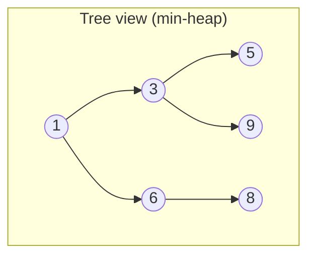
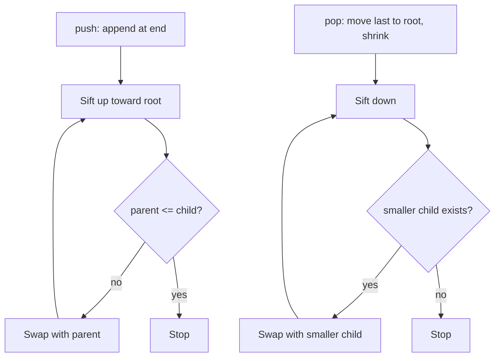

# Heap

## Concept

A binary heap is a complete binary tree stored compactly in an array, satisfying the heap property: in a min-heap every parent is less than or equal to its children (a max-heap reverses the comparison). Because the tree is complete, the children of index `i` live at `2i+1` and `2i+2`, and the parent at `(i-1)/2`, so no references are needed. The minimum (or maximum) element is always at the root, retrievable in O(1), while insertions sift a new element up and removals sift the moved last element down to restore the property. Heaps are the engine behind priority queues and heapsort.

## Mermaid



Array layout: `[1, 3, 6, 5, 9, 8]` — index 0 is the root; child(i) = 2i+1, 2i+2.

## Complexity

- Peek (top): O(1)
- Push (insert + sift-up): O(log n)
- Pop (remove top + sift-down): O(log n)
- Build heap from n elements: O(n)
- Space: O(n)

## Java Code

```java
import java.util.ArrayList;
import java.util.Collections;
import java.util.List;

// Array-based min-heap.
public class MinHeap {
    private final List<Integer> a = new ArrayList<>();

    public void push(int x) {
        a.add(x);
        int i = a.size() - 1;
        // Sift up: swap with parent while smaller than it.
        while (i > 0) {
            int parent = (i - 1) / 2;
            if (a.get(parent) <= a.get(i)) break;
            Collections.swap(a, parent, i);
            i = parent;
        }
    }

    public int top() { return a.get(0); }  // smallest element

    public void pop() {
        int last = a.size() - 1;
        a.set(0, a.get(last));   // move last element to root
        a.remove(last);
        int i = 0, n = a.size();
        // Sift down: swap with the smaller child while it violates the order.
        while (true) {
            int l = 2 * i + 1, r = 2 * i + 2, smallest = i;
            if (l < n && a.get(l) < a.get(smallest)) smallest = l;
            if (r < n && a.get(r) < a.get(smallest)) smallest = r;
            if (smallest == i) break;
            Collections.swap(a, i, smallest);
            i = smallest;
        }
    }

    public boolean isEmpty() { return a.isEmpty(); }
}
```

## Mini Usage Example

```java
import java.util.Collections;
import java.util.PriorityQueue;

MinHeap h = new MinHeap();
for (int x : new int[]{6, 1, 9, 3, 8, 5}) h.push(x);
System.out.println(h.top());  // 1
h.pop();
System.out.println(h.top());  // 3

// The standard library equivalent: java.util.PriorityQueue is a min-heap by default.
PriorityQueue<Integer> pq = new PriorityQueue<>();                       // peek() is the smallest
PriorityQueue<Integer> maxpq = new PriorityQueue<>(Collections.reverseOrder()); // max-heap
```

## Code Snippet Flow


