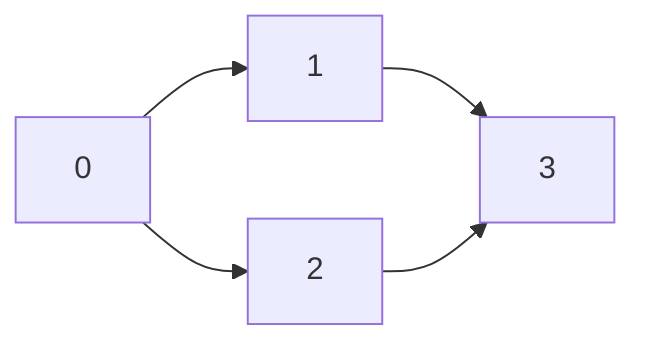
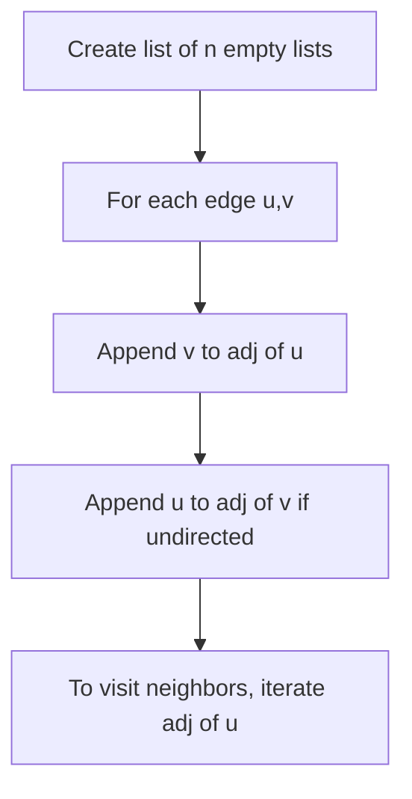

# Adjacency List

## Concept

An adjacency list represents a graph as an array (or list) of lists, where entry `g.get(u)` holds every vertex adjacent to `u`. It stores only the edges that actually exist, so its space is O(V + E), which is far more compact than a matrix for sparse graphs. Iterating over a vertex's neighbors is proportional to that vertex's degree, making it the natural representation for traversals like BFS and DFS. The trade-off is that checking whether a specific edge `(u, v)` exists requires scanning `u`'s list rather than a single array lookup.

## Mermaid



List form: `0 -> [1,2]`, `1 -> [3]`, `2 -> [3]`, `3 -> []`.

## Complexity

- Space: O(V + E)
- Add edge: O(1)
- Iterate neighbors of u: O(deg(u))
- Check whether edge (u, v) exists: O(deg(u))
- Full traversal of all edges: O(V + E)

## Java Code

```java
import java.util.ArrayList;
import java.util.List;

class Graph {
    final int n;                      // number of vertices
    final List<List<Integer>> adj;    // adj.get(u) = neighbors of u

    Graph(int n) {
        this.n = n;
        this.adj = new ArrayList<>();
        for (int i = 0; i < n; i++) adj.add(new ArrayList<>());
    }

    // Undirected edge: record both directions.
    void addEdge(int u, int v) {
        adj.get(u).add(v);
        adj.get(v).add(u);
    }

    void print() {
        for (int u = 0; u < n; u++) {
            StringBuilder sb = new StringBuilder().append(u).append(':');
            for (int v : adj.get(u)) sb.append(' ').append(v);
            System.out.println(sb);
        }
    }
}
```

## Mini Usage Example

```java
Graph g = new Graph(4);
g.addEdge(0, 1);
g.addEdge(0, 2);
g.addEdge(1, 3);
g.addEdge(2, 3);
g.print();
// 0: 1 2
// 1: 0 3
// 2: 0 3
// 3: 1 2
```

## Code Snippet Flow


