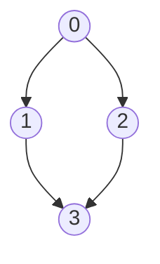
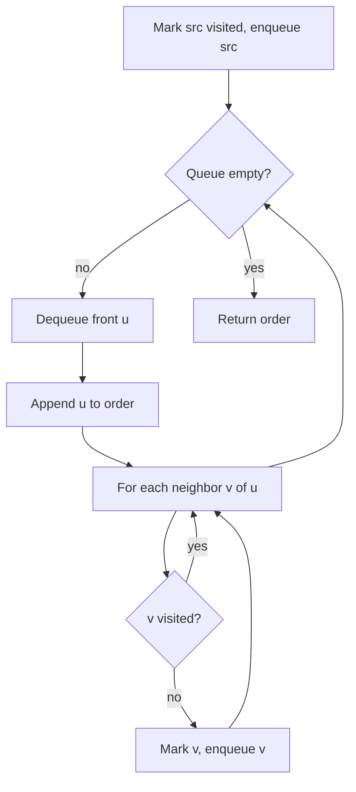

# BFS

## Concept

Breadth-first search explores a graph level by level: it visits the source, then all vertices one edge away, then all two edges away, and so on. It uses a FIFO queue and a visited marker so each vertex is processed exactly once. Because it expands outward in rings, BFS finds the shortest path (fewest edges) from the source to every reachable vertex in an unweighted graph. Typical uses include shortest-path-by-hops, connectivity checks, and computing distances from a single source.

## Mermaid



Visit order from source 0: `0, 1, 2, 3` (level 0, then level 1, then level 2).

## Complexity

- Time: O(V + E) — each vertex enqueued once, each edge examined once
- Space: O(V) for the visited array and the queue

## Java Code

```java
import java.util.ArrayDeque;
import java.util.ArrayList;
import java.util.Deque;
import java.util.List;

class Bfs {
    // Returns vertices in the order BFS visits them, starting at src.
    static List<Integer> bfsOrder(int src, List<List<Integer>> g) {
        boolean[] visited = new boolean[g.size()];
        List<Integer> order = new ArrayList<>();
        Deque<Integer> q = new ArrayDeque<>();  // ArrayDeque as a FIFO queue
        visited[src] = true;     // mark before enqueue to avoid duplicates
        q.offer(src);

        while (!q.isEmpty()) {
            int u = q.poll();
            order.add(u);                    // u is fully discovered
            for (int v : g.get(u)) {         // scan neighbors
                if (!visited[v]) {
                    visited[v] = true;
                    q.offer(v);
                }
            }
        }
        return order;
    }
}
```

## Mini Usage Example

```java
// Adjacency list: 0->{1,2}, 1->{3}, 2->{3}, 3->{}
List<List<Integer>> g = List.of(
        List.of(1, 2), List.of(3), List.of(3), List.of());
List<Integer> order = Bfs.bfsOrder(0, g);
// order == [0, 1, 2, 3]
```

## Code Snippet Flow


