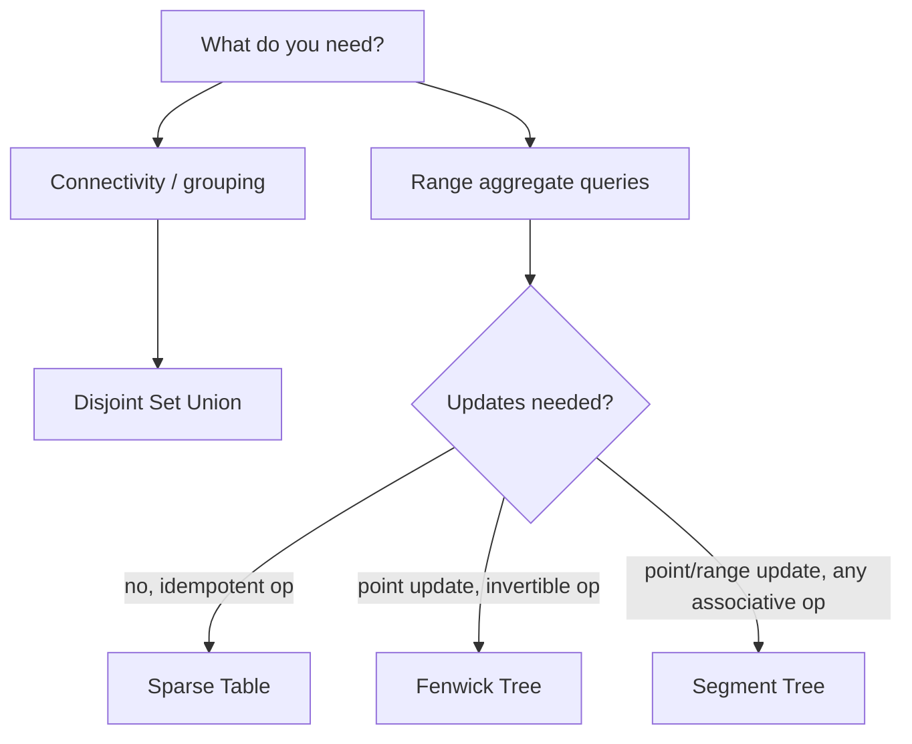

# Advanced Complexity Table

## Concept

This page compares the advanced structures in this chapter so you can pick the right tool for a query workload. The recurring trade-off is between what kinds of queries and updates a structure supports and how cheaply it supports them. Disjoint set union answers connectivity/grouping queries in near-constant time. Fenwick and segment trees both answer range aggregate queries with point (or range) updates in logarithmic time, with the Fenwick tree being smaller and simpler but limited to invertible aggregates. A sparse table is the fastest for idempotent range queries (like min/max) but only on a static array. The table below summarizes the per-operation Big-O.

## Mermaid



## Complexity

| Structure | Build | Update | Query | Space | Notes |
|---|---|---|---|---|---|
| Disjoint Set Union | O(n) | O(alpha(n)) union | O(alpha(n)) find | O(n) | Union by rank + path compression; alpha is inverse Ackermann (effectively constant). Connectivity/grouping only. |
| Fenwick Tree (BIT) | O(n) | O(log n) point | O(log n) prefix/range | O(n) | Simple and cache-friendly; needs an invertible aggregate (range = prefix(r) - prefix(l-1)). 1-indexed. |
| Segment Tree | O(n) | O(log n) point | O(log n) range | O(n) (~4n) | Any associative merge (sum/min/max/gcd); range updates via lazy propagation. |
| Sparse Table | O(n log n) | not supported | O(1) | O(n log n) | Static array only; query must be idempotent (min, max, gcd). No updates after build. |

> Note: in Java, sum aggregates use the 64-bit `long` type. It does not auto-promote like Python's arbitrary-precision integers, so totals exceeding 2^63 - 1 wrap silently — size the accumulator accordingly.

## Java Code

```java
// The structures compared above (see their individual pages for full code):
//
//   DSU          : find/unite with union-by-rank + path compression
//   Fenwick      : add(i,val) and prefix(i) using i & -i bit tricks
//   SegTree      : build / update / query over a binary tree of segments
//   Sparse Table : st[k][i] = aggregate of [i, i + 2^k - 1], built bottom-up
//
// Selection guide:
//   - Only "are these connected / same group?"        -> DSU
//   - Mutable prefix/range SUM with point updates      -> Fenwick (smallest)
//   - Mutable range min/max/sum/gcd, point/range upd.  -> Segment Tree
//   - Static array, repeated O(1) range min/max/gcd    -> Sparse Table
```

## Mini Usage Example

```java
// Choosing for a problem with frequent range-sum queries AND point updates
// on a mutable array of size n:
//   - Fenwick if you only ever need sums      -> O(log n) per op, minimal memory
//   - Segment tree if you may later need min  -> O(log n) per op, more flexible
//
// For a static array where you only query range minimums many times:
//   - Sparse table: O(n log n) build once, then O(1) per query.
```

## Code Snippet Flow

```mermaid
flowchart TD
    A[Need range query?] -->|no, just grouping| B[Use DSU]
    A -->|yes| C{Array mutable?}
    C -->|no, idempotent op| D[Sparse Table, O(1) query]
    C -->|yes, sum only| E[Fenwick Tree]
    C -->|yes, any associative op| F[Segment Tree]
```
