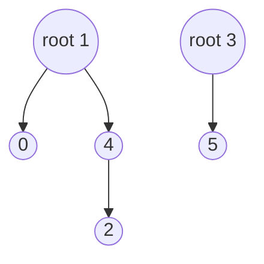
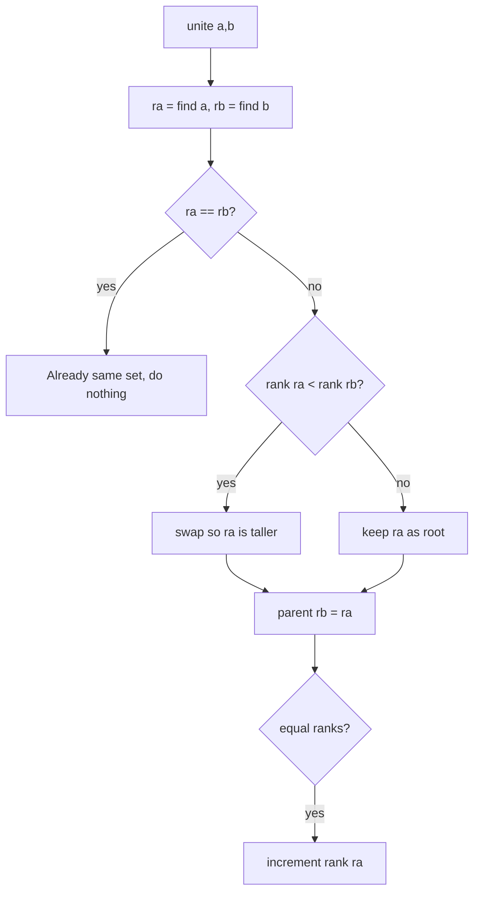

# Disjoint Set Union

## Concept

A disjoint set union (DSU), also called union-find, maintains a collection of non-overlapping sets and answers two questions efficiently: which set does an element belong to (`find`), and merge the sets of two elements (`union`). Each set is a tree whose root acts as the set's representative; two elements are in the same set exactly when they share a root. Two optimizations make it almost constant time: union by rank attaches the shorter tree under the taller one to keep trees flat, and path compression points every node visited during `find` directly at the root. It is the standard tool for connectivity queries, Kruskal's MST, and grouping equivalences.

## Mermaid



Two sets: {0,1,2,4} rooted at 1, and {3,5} rooted at 3.

## Complexity

- find / union: O(alpha(n)) amortized, where alpha is the inverse Ackermann function (effectively constant, < 5 for any practical n)
- Without optimizations: O(n) worst case per operation
- Space: O(n) for the parent and rank arrays

## Java Code

```java
import java.util.Arrays;

class DSU {
    final int[] parent;
    final int[] rank;   // upper bound on tree height

    DSU(int n) {
        parent = new int[n];
        rank = new int[n];                 // int[] is zero-filled by default
        for (int i = 0; i < n; i++) parent[i] = i; // each element its own root
    }

    // Find with path compression: re-point nodes straight to the root.
    int find(int x) {
        if (parent[x] != x) parent[x] = find(parent[x]);
        return parent[x];
    }

    // Union by rank: hang the shorter tree under the taller one.
    boolean unite(int a, int b) {
        int ra = find(a), rb = find(b);
        if (ra == rb) return false;        // already in the same set
        if (rank[ra] < rank[rb]) { int t = ra; ra = rb; rb = t; }
        parent[rb] = ra;
        if (rank[ra] == rank[rb]) ++rank[ra];
        return true;
    }

    boolean connected(int a, int b) { return find(a) == find(b); }
}
```

## Mini Usage Example

```java
DSU dsu = new DSU(6);
dsu.unite(0, 1);
dsu.unite(2, 4);
dsu.unite(0, 4);

dsu.connected(1, 2);  // true  (1-0-4-2 all merged)
dsu.connected(1, 3);  // false (3 is still alone)
```

## Code Snippet Flow


