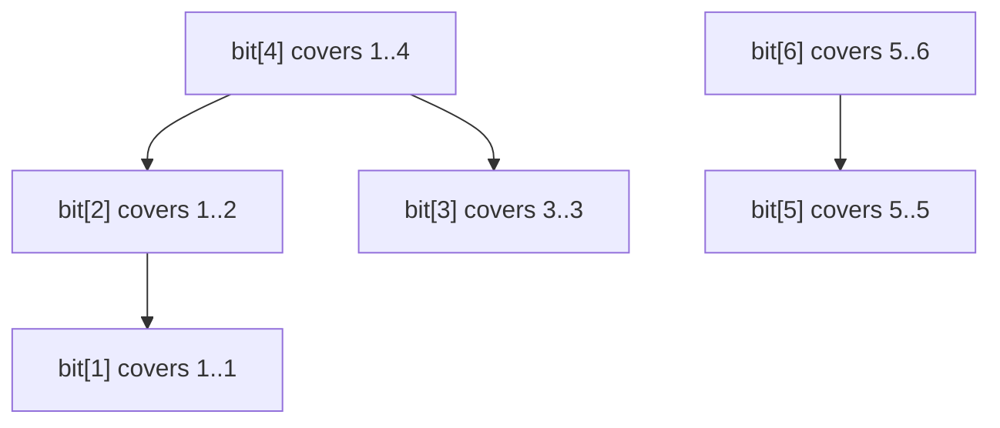
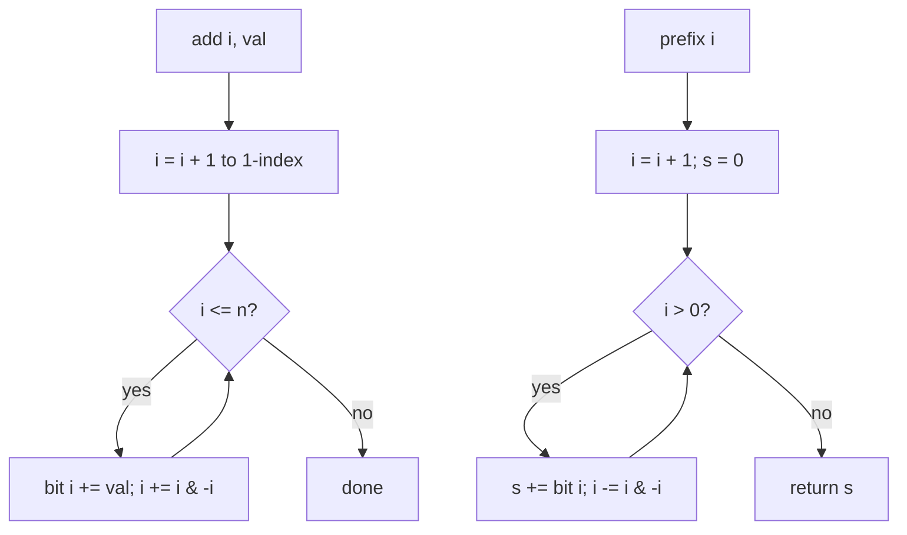

# Fenwick Tree

## Concept

A Fenwick tree (binary indexed tree, BIT) maintains prefix aggregates of an array while allowing both point updates and prefix queries in logarithmic time. The trick is that index `i` is responsible for a range of `i & (-i)` elements (the lowest set bit), so updates and queries jump through the array by repeatedly adding or stripping that low bit. This gives a structure far smaller and simpler than a segment tree when you only need sums (or other invertible aggregates) and point updates. It is the go-to tool for running prefix sums, frequency counts, and inversion counting; range sums come from `prefix(r) - prefix(l-1)`.

## Mermaid



Each `bit[i]` aggregates the `i & -i` elements ending at index `i` (1-indexed).

## Complexity

- Point update (add): O(log n)
- Prefix-sum query: O(log n)
- Range sum (via two prefix queries): O(log n)
- Build from array: O(n) or O(n log n) by repeated update
- Space: O(n)

## Java Code

```java
// 1-indexed internally; public API uses 0-indexed positions.
class Fenwick {
    final int n;
    final long[] bit;   // long is 64-bit: large sums can still overflow silently

    Fenwick(int n) {
        this.n = n;
        this.bit = new long[n + 1];   // long[] is zero-filled by default
    }

    // Add val at index i (0-indexed). Climb by adding the lowest set bit.
    void add(int i, long val) {
        for (++i; i <= n; i += i & (-i))
            bit[i] += val;
    }

    // Sum of indices [0, i] (inclusive). Descend by stripping the low bit.
    long prefix(int i) {
        long s = 0;
        for (++i; i > 0; i -= i & (-i))
            s += bit[i];
        return s;
    }

    // Sum of [l, r] inclusive.
    long range(int l, int r) {
        return prefix(r) - (l > 0 ? prefix(l - 1) : 0);
    }
}
```

## Mini Usage Example

```java
// Underlying array conceptually: index 0..5
Fenwick fw = new Fenwick(6);
fw.add(0, 3);
fw.add(2, 5);
fw.add(5, 2);

fw.prefix(2);     // 8  (3 + 0 + 5)
fw.range(2, 5);   // 7  (5 + 0 + 0 + 2)
fw.add(2, -1);    // update: index 2 now holds 4
fw.range(2, 5);   // 6
```

## Code Snippet Flow


