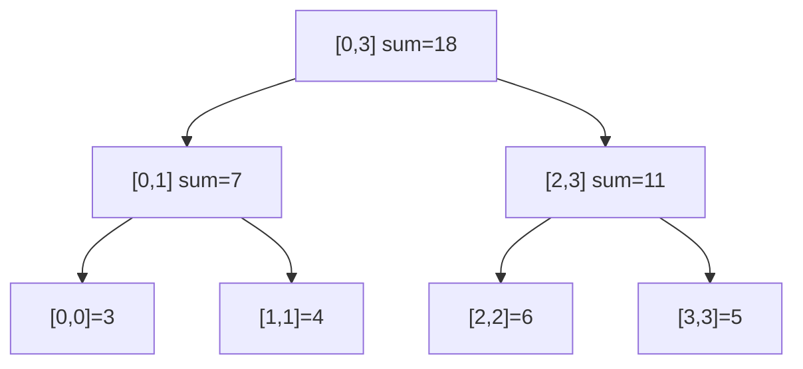
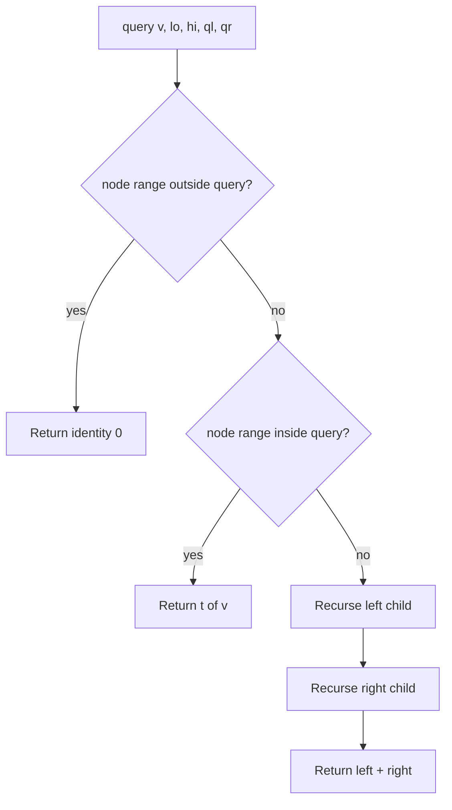

# Segment Tree

## Concept

A segment tree stores an array at the leaves of a binary tree and keeps an aggregate (here, a sum) of each contiguous segment at the internal nodes. Any range query is answered by combining O(log n) precomputed segments that together tile the queried interval, and a point update propagates from a leaf up to the root touching only O(log n) nodes. Unlike a Fenwick tree it handles a wide variety of associative operations (sum, min, max, gcd) and extends to range updates with lazy propagation. It is the standard choice when you need both fast range queries and updates over a mutable array.

## Mermaid



## Complexity

- Build: O(n)
- Point update: O(log n)
- Range query: O(log n)
- Space: O(n) (commonly allocated as 4n nodes)

## Java Code

```java
class SegTree {
    final int n;
    final long[] t;   // t[1] is the root; children of v are 2v and 2v+1
                      // long is 64-bit: large sums can still overflow silently

    SegTree(long[] a) {
        this.n = a.length;
        this.t = new long[4 * Math.max(1, a.length)];
        if (n > 0) build(a, 1, 0, n - 1);
    }

    // Build node v covering array range [lo, hi].
    private void build(long[] a, int v, int lo, int hi) {
        if (lo == hi) { t[v] = a[lo]; return; }
        int mid = (lo + hi) / 2;
        build(a, 2 * v, lo, mid);
        build(a, 2 * v + 1, mid + 1, hi);
        t[v] = t[2 * v] + t[2 * v + 1];   // merge = sum
    }

    // Set position pos to value val.
    void update(int pos, long val) { update(1, 0, n - 1, pos, val); }
    private void update(int v, int lo, int hi, int pos, long val) {
        if (lo == hi) { t[v] = val; return; }
        int mid = (lo + hi) / 2;
        if (pos <= mid) update(2 * v, lo, mid, pos, val);
        else            update(2 * v + 1, mid + 1, hi, pos, val);
        t[v] = t[2 * v] + t[2 * v + 1];
    }

    // Sum over [ql, qr] inclusive.
    long query(int ql, int qr) { return query(1, 0, n - 1, ql, qr); }
    private long query(int v, int lo, int hi, int ql, int qr) {
        if (qr < lo || hi < ql) return 0;           // no overlap
        if (ql <= lo && hi <= qr) return t[v];      // total overlap
        int mid = (lo + hi) / 2;                    // partial overlap
        return query(2 * v, lo, mid, ql, qr)
             + query(2 * v + 1, mid + 1, hi, ql, qr);
    }
}
```

## Mini Usage Example

```java
long[] a = {3, 4, 6, 5};
SegTree st = new SegTree(a);

st.query(0, 3);   // 18  (full range sum)
st.query(1, 2);   // 10  (4 + 6)
st.update(2, 1);  // a[2] = 1
st.query(0, 3);   // 13  (3 + 4 + 1 + 5)
```

## Code Snippet Flow


